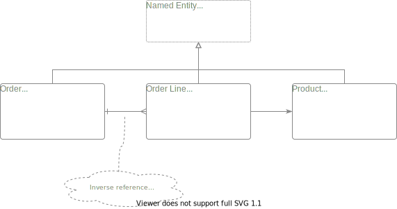
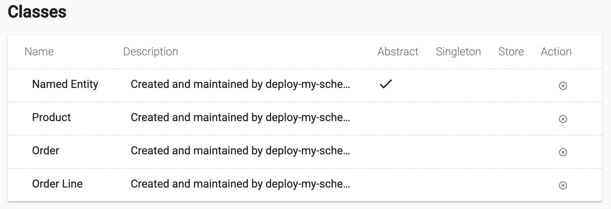

# Example of creating frusal.com schema by a script

**[TL;CR](./deploy-my-schema.mjs)**

An example JavaScript to create workspace schema and data at [frusal.com]. Workspace schema consists of classes, fields and other metadata. Script is to be executed on client side under [Node.js].

This example creates a model for basic shop or manufacturing support system. It is Order centric. It demonstrates an abstract class, inheritance, regular and inverse references, collection and primitive type fields.

## The UML diagram of the schema



*[edit](https://app.diagrams.net/?mode=github#Hfrusal%2Ffrusal-example-schema-by-javascript%2Fmaster%2Fuml-diagram.svg) at diagrams.net*

## Usage

Providing that you have [Node.js] installed, you need to login to the workspace with [frusal CLI]:

```text
npx frusal login
```

<details><summary>See the console output</summary>

```txt
Frusal login: unit.test@fruit-salad.tech
Password:
Please choose a workspace:
[1] Unit Test
Workspace [1]: 1

CONNECTED to workspace 'Unit Test' (ws_001_unit_test) as 'unit.test@fruit-salad.tech'
```

</details>

and then run the [script](./deploy-my-schema.mjs):

```text
node --experimental-json-modules ./deploy-my-schema.mjs
```

<details><summary>See the console output</summary>

```txt
Connecting to workspace "ws_001_unit_test"...
Creating classes at module "My Module"...
Schema changes deployed.
```

</details>

Check with [frusal.com] web UI that the classes are correctly created:



## Essence

The code to create the schema is in **[deploy-my-schema.mjs](./deploy-my-schema.mjs)**.

The other files in this repository are much less interesting. Fell free to copy this file into your project and use it as a starting point for the script which controls your schema. Unless you prefer to configure your schema through web UI, which is more common at early stage or for the smaller projects.

## Next

More information: [Frusal CLI], [Angular Tutorial], [React Tutorial], [Node.js Tutorial] and [frusal.com].

[frusal.com]: https://frusal.com
[Node.js]: https://nodejs.org
[Frusal CLI]: https://github.com/frusal/frusal-cli#readme
[Angular Tutorial]: https://github.com/frusal/frusal-tutorial-angular
[React Tutorial]: https://github.com/frusal/frusal-tutorial-react
[Node.js Tutorial]: https://github.com/frusal/frusal-tutorial-node
