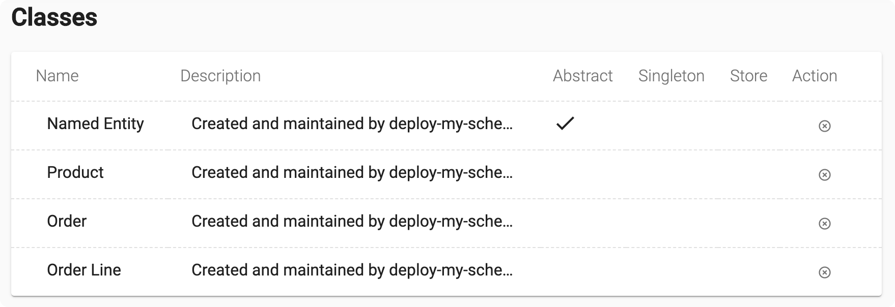

# Example of creating frusal.com schema by a script

**[TL;CR](./deploy-my-schema.mjs)**

An example JavaScript to create workspace schema and data at [frusal.com]. Workspace schema consists of classes, fields and other metadata. Script is to be executed on client side under [Node.js].

This example creates a model for a basic shop or manufacturing support system. It is Order centric. It demonstrates an abstract class, inheritance, regular and inverse references, collection and primitive type fields.

## The UML diagram of the schema


by diagrams.net ([edit](https://app.diagrams.net/?mode=github#Hfrusal%2Ffrusal-example-schema-by-javascript%2Fmaster%2Fuml-diagram.svg))

## Application

Providing that you have [Node.js] installed, you need to login to the workspace:

```text
npx frusal login
```

and then run the [script](./deploy-my-schema.mjs):

```text
node ./deploy-my-schema.mjs
```

Check with frusal web UI that the classes are created correctly:



## Understanding

The code to create schema is **[here](./deploy-my-schema.mjs)**. The other files of this repository are much less interesting. Fell free to copy this file into your project and use it as a starting point for the script which controls your schema, if you prefer to control it by script.

[frusal.com]: https://frusal.com
[Node.js]: https://nodejs.org
